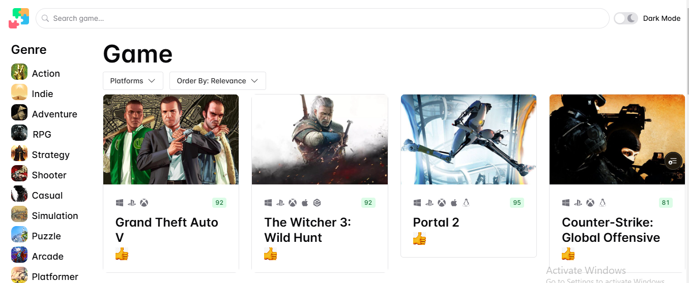
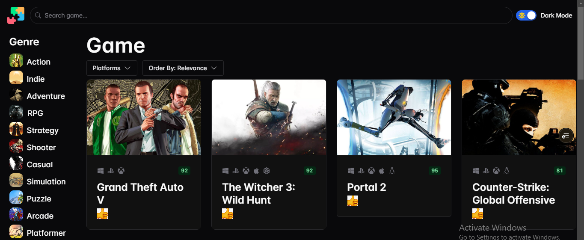
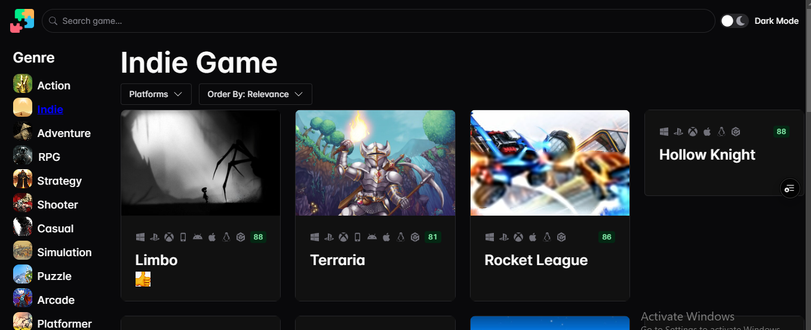
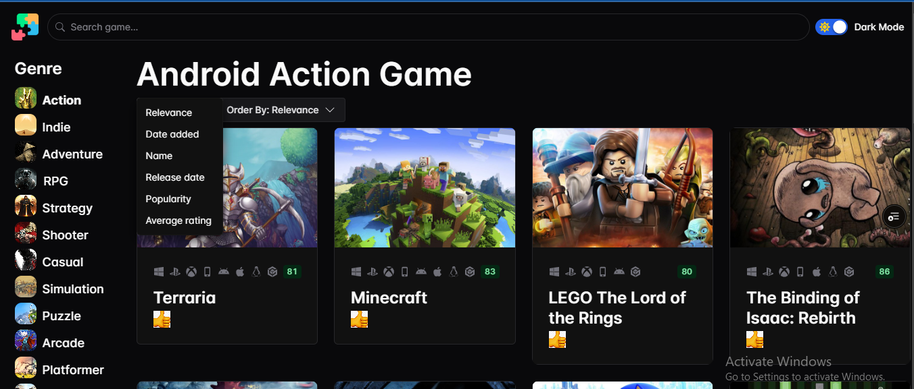
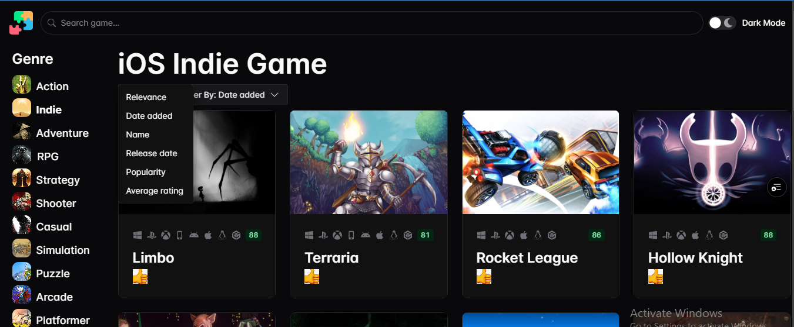

# Game Hub

## 📌 Overview
The **Game Hub** is a web application that allows users to search for games using a search bar, filter games by genre or platform, and sort results by relevance. It features both **light and dark themes**, implemented using **Chakra UI**. The app also utilizes **React Query** for caching and automatic retries, ensuring a smooth and responsive experience. It is fully responsive for mobile and tablets.

## 🚀 Features
- 🔍 **Search Games**: Find games by name using a dynamic search bar.
- 🎮 **Filter by Genre & Platform**: Narrow down searches based on game genre or supported platform.
- 📊 **Sort by Relevance**: Display games in the most relevant order.
- 🌙 **Light & Dark Mode**: Seamless theme switching for better user experience.
- ⚡ **Optimized Performance**: Uses **React Query** for efficient data fetching, caching, and retrying failed requests.
- 🎨 **Modern UI**: Designed with **Chakra UI** for an accessible and responsive interface.
- 📱 **Fully Responsive**: Works seamlessly on mobile devices and tablets.

## 🛠️ Tech Stack
- **Frontend**: React, Vite, Chakra UI
- **State Management & Caching**: React Query
- **API**: Rawg.io (or specify the game API used)

## 🔧 Installation & Setup
### 1️⃣ Clone the Repository
```bash
git clone https://github.com/mosnyik/game-hub.git
cd game-hub
```

### 2️⃣ Install Dependencies
```bash
npm install
# or
yarn install
```

### 3️⃣ Set Up Environment Variables
Create a `.env` file in the root directory and add:
```env
VITE_RAWG_API=your_rawg_api_key_here
```

### 4️⃣ Start the Development Server
```bash
npm run dev
# or
yarn dev
```

## 📸 Screenshots








## 🏗️ Project Structure
```
/game-hub
│── public/           # Static assets
│── src/
│   ├── assets/       # Images and other static files
│   ├── components/   # Reusable UI components
│   ├── hooks/        # Custom React hooks
│   ├── services/     # API services
│   ├── types/        # TypeScript type definitions
│   ├── App.tsx       # Main app entry point
│   ├── main.tsx      # Root file
│
│── .env.example      # Environment variable template
│── vite.config.ts    # Vite configuration
│── README.md         # Project documentation
```

## 🚀 Deployment
### 🏗️ Build the App
```bash
npm run build
# or
yarn build
```
### 🌐 Deploy on Vercel
```bash
vercel
```
Or deploy on **Netlify**, **Firebase**, or your preferred hosting platform.

## 🐛 Troubleshooting & Debugging
- If the API is not fetching data, ensure your `.env` file contains a valid API key.
- If styling issues occur, check Chakra UI configuration.
- For caching issues, clear React Query cache using `queryClient.clear()`.

## 🙌 Contributing
Feel free to open issues and submit pull requests! Follow these steps:
1. Fork the repository
2. Create a feature branch: `git checkout -b feature-name`
3. Commit changes: `git commit -m "feat: feature-name" -m "feature function"`
4. Commit changes: `git commit -m "Refactor: concerned code" -m "what you did"`
5. Push to branch: `git push origin feature-name`
6. Open a pull request

## 📜 License
This project is licensed under the [MIT License](LICENSE).

## 📞 Contact
For questions or suggestions, reach out via:
- **Email**: mosnyik@gmail.com
- **GitHub**: [@mosnyik](https://github.com/mosnyik)
- **Twitter**: [@mosnyik](https://twitter.com/mosnyik)

---
### 🎮 Happy Gaming! 🚀

